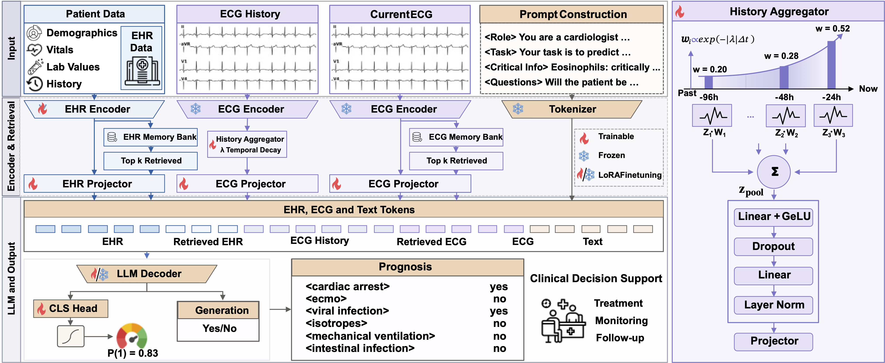

# PRISM: Retrieval-Augmented Multimodal Language Model with Heterogeneous Evidence Grounding for Clinical Prognosis

This repository release contains the implementation and evaluation scripts for the PRISM paper.


## Method Overview

PRISM uses a multimodal clinical pipeline with ECG and EHR representations, followed by prompt-based evaluation.

- Multimodal encoding is implemented under `llava/model/multimodal_encoder/`.
- Language-model integration is implemented under `llava/model/language_model/`.
- Core evaluation entrypoint is `llava/train/evaluate.py`.
- Training utilities retained for dependency completeness:
  - `llava/train/train_stage1.py`
  - `llava/train/train_stage2.py`

## Figure

## Architecture




## Running This Repository

Install dependencies from the environment:

```bash
pip install -r requirements.txt
```

Main entrypoint:

```bash
bash prism.sh
```

The script expects the following environment variables (set in shell before running):

- `CHECKPOINT`
- `FAISS_DIR`
- `TEST_JSON`
- `TRAIN_CSV`
- `TEST_CSV`
- `PATIENT_JSON`
- `H5_ROOT`
- `OUTPUT_DIR`

Optional:

- `ECG_CACHE` (default: empty)
- `MEDGEMMA_MODEL` (default: `google/medgemma-4b-it`)

Minimal example:

```bash
export CHECKPOINT=/path/to/checkpoint
export FAISS_DIR=/path/to/faiss_index
export TEST_JSON=/path/to/test_raft2.json
export TRAIN_VAL_CSV=/path/to/mds_ed_train.csv
export TEST_CSV=/path/to/mds_ed_test.csv
export PATIENT_JSON=/path/to/patient_data_96h.json
export H5_ROOT=/path/to/mimic_h5
export OUTPUT_DIR=/path/to/output_eval_dir
bash prism.sh
```

Outputs are written to `OUTPUT_DIR` (predictions, summary JSON/CSV, and analysis artifacts).
<!-- 
## Citation

If you use this code, cite the PRISM manuscript: -->

